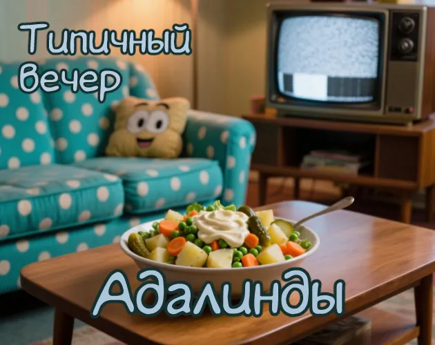

# itch.io

```html
<h1 style="text-align: center;">Типичный вечер Адалинды</h1>

<div style="width: 100%;">
  <ul style="margin-bottom: 0; padding: 0; text-align: center;">
    <span style="font-size: 12px;">16+</span>
  </ul>
  <ul style="margin-top: 0; padding: 0; text-align: center;">
    <span style="font-size: 12px;">квест</span><span style="padding: 4px; font-size: 12px;">·</span><span style="font-size: 12px;">повседневность</span><span style="padding: 4px; font-size: 12px;">·</span><span style="font-size: 12px;">юмор</span><span style="padding: 4px; font-size: 12px;">·</span><span style="font-size: 12px;">симулятор готовки</span>
  </ul>
  <ul style="margin-top: 0; padding: 0; text-align: center;">
    <span style="font-size: 12px;">Проходится за ~13 минут (если знать, что делать)</span>
  </ul>
</div>

<p>План прост: любимая передача и салатик — но салат не сделан, телевизор сломан, ещё и бывший припёрся...</p>

<p>От игры ждать:</p>
<ul>
<li>Реалистичное (почти) приготовление салатика</li>
<li>Решение бытовых и острых межличностных вопросов</li>
<li>Изготовление дробящего оружия с помощью овощей</li>
<li>И многое-многое другое (если сделаем когда-нибудь)</li>
</ul>

<p>Создано специально на <a href="https://forum.ifiction.ru/viewtopic.php?pid=41109">Паровозик 9: Летняя ёлка</a> на Инстеде с болью, кровью и полыханиями. Приятного просмотра.</p>
```

## Обложка



<!-- todo: добавить скриншоты -->
